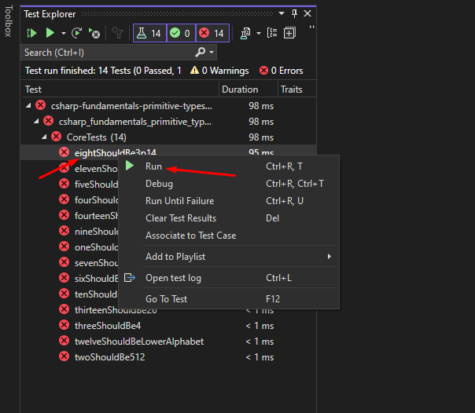
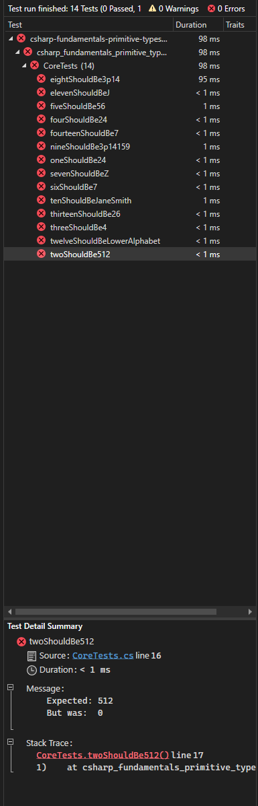

# Object-oriented Programming - Inheritance

## Learning Objectives
- Explain that inheritance cascades methods from a superclass
- Explain how superclass methods can be overridden in a subclass
- Use composition as an alternative to inheritance

## Set up instructions
- Fork this repository and clone the forked version to your machine
- Open the tdd-oop-inheritance.sln in Visual Studio

## Introduction

We can think of inheritance as one class literally inheriting behaviour from another class, just as a human child might inherit certain behaviour from their parent. We call the parent a *superclass* and the child a *subclass*. It can be useful when we want multiple classes to do a particular thing. Consider the example below:

```C#
class Car {
    int topSpeed;
    
    public Car(int topSpeed) {
        this.topSpeed = topSpeed;
    }
    
    public string move() {
        return "Moving at " + this.topSpeed;
    }
}

class Bike {
    int topSpeed;

    public Car(int topSpeed) {
        this.topSpeed = topSpeed;
    }

    public string move() {
        return "Moving at " + this.topSpeed;
    }
}

class Plane {
    int topSpeed;

    public Car(int topSpeed) {
        this.topSpeed = topSpeed;
    }

    public string move() {
        return "Moving at " + this.topSpeed;
    }
}
```

There is a lot of repetition here. In previous exercises we used dependency injection to solve a similar problem, which is usually the better technique and is referred to as *composition*, but we can also solve the problem using inheritance:

```C#
class Vehicle {
    int topSpeed;
    
    public Vehicle(int topSpeed) {
        this.topSpeed = topSpeed;
    }
    
    public string move() {
        return "Moving at " + this.topSpeed;
    }
}

class Car : Vehicle {
    
}

class Bike : Vehicle {
    
}
```

In the above example, we created a superclass named `Vehicle` and two subclasses that inherit the `topSpeed` state and the `move()` method. We would be able to use them as normal; `car.move()`, `bike.move()`.

Important to note is that we can still access the methods of the superclass from within the child class using the word `base`, for example if we need to supply additional information to a child constructor:

```C#
class Car : Vehicle {
    string transmissionType;
    
    public Car(string transmissionType, int topSpeed) : base(topSpeed) {
        this.transmissionType = transmissionType;
    }
}
```

When your parent class has a constructor that accepts values, you'll have to call `base(...params)` to run the constructor of the superclass.

We can also replace methods in the superclass by *overriding* them, and we do this by marking a method as an `override`:

```C#
class Vehicle {
    int topSpeed;
    
    public Vehicle(int topSpeed) {
        this.topSpeed = topSpeed;
    }
    
    public string move() {
        return "Moving at " + this.topSpeed;
    }
}

class Plane : Vehicle {
    public override string move() {
        return "Taking off... " + base.move();
    }
}
```

## Exercise 1

There are some classes and tests in the usual place. It's a basic implementation of a library's collection of books, articles and newspapers, with quite a bit of repetition and redundancy.

- Refactor the code base using inheritance to remove the repetition
- Modify the existing tests to prove your solution works as intended
- Create a test suite for the `Library` class, as well as any new classes you create

## Exercise 2

Books and Articles should both hold information about their authors (name, contact information, website). Newspapers should not have this information as they are written by multiple people.

Introduce this new functionality with an Author class, and use *composition* (dependency injection) rather than inheritance to complete it.

You must create useful tests / update the necessary existing ones.

As an end result, this repository should contain a complete solution that uses both inheritance and composition together.

## Test Output



When you run a test, it's either going to pass or fail. When it fails, you'll be presented with a big red stream of text. This is called a stack trace and, though intimidating, does contain some useful information.

One of the core skills of a developer is debugging stack traces like this. The stack trace details in which classes & files the failure happened, and gives you a line number at the end. Most of the lines in the stack trace are irrelevant most of the time, you want to try and identify the files that you're actually working with.

In the sample screenshot below, we've tried to complete the first step of the exercise but provided an invalid value. Then we run the test associated with it and we see a big red stack trace, a test failure.

At the top, we see `expected: 512 but was: 0`. This means the test expected the value to be 512, but the value the student provided was 0.

In the stack trace itself, we see this line: `1.  at csharp_fundamentals_primitive_types.Test.CoreTests.twoShouldBe512() in C:\Dev\boolean\csharp\fundamentals\csharp-fundamentals-primitive-types\src\csharp-fundamentals-primitive-types.Test\CoreTests.cs:line 17`. This is helpful! This tells us the exact line in the `CoreTests.cs` file (line 17) where the failure happened, as well as the method name (twoShouldBe512), helping us to identify where the issue began. This is the kind of thing you need to look for; a relevant file name, method name, class name and line number to give you a good starting point for debugging.

